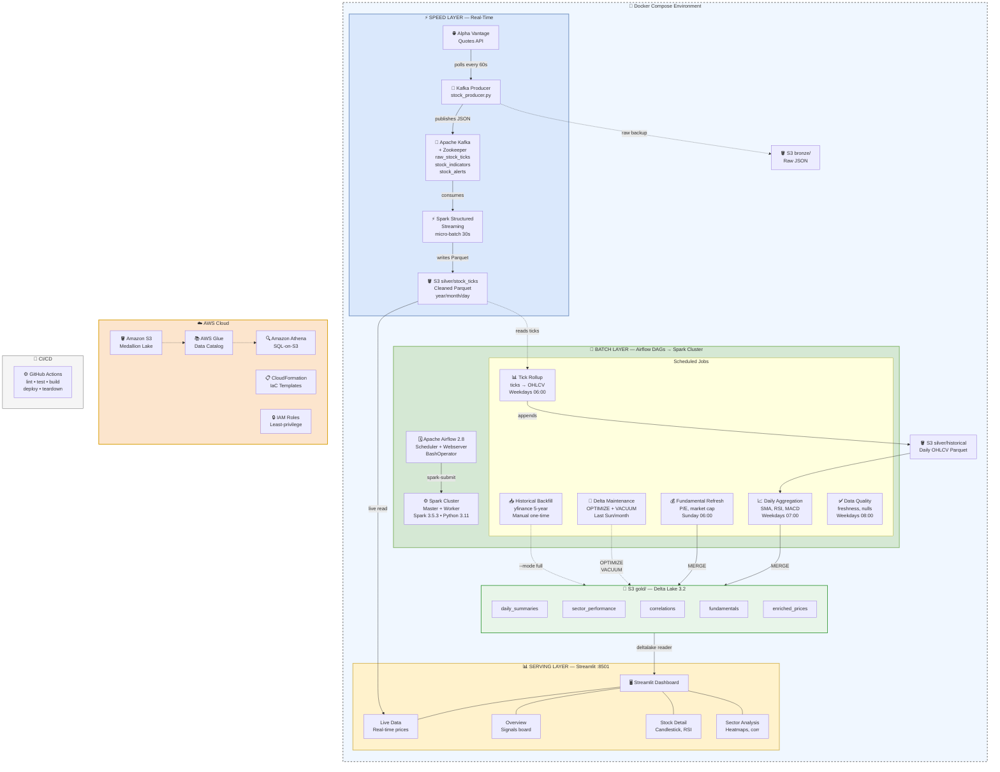
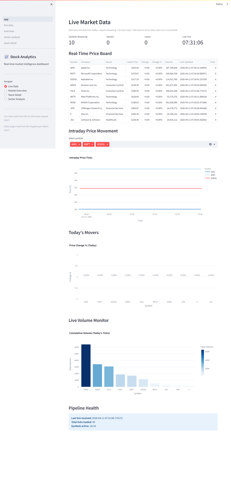

# Real-Time Stock Market Analytics Pipeline

[](https://github.com/Vulasala-Hari-Krishna/Real-Time-Stock-Market-Analysis/actions/workflows/ci.yaml)

[](LICENSE)

An end-to-end **Lambda Architecture** stock market analytics platform that
ingests live quotes from Alpha Vantage, streams them through Kafka and Spark
Structured Streaming, stores data in a **medallion architecture** (bronze →
silver → gold) on **AWS S3**, orchestrates batch enrichment with **Airflow**,
and surfaces interactive dashboards — **live** and **historical** — via
**Streamlit**.  All containerised with Docker and deployed through
**CloudFormation**.

---

## Architecture (Lambda Architecture)

> **[Interactive diagram →](docs/architecture.drawio)**  *(open in [draw.io](https://app.diagrams.net) — free)*

```
                              SPEED LAYER (real-time)
 ┌────────────────┐   ┌───────────┐   ┌──────────────────┐   ┌─────────────────────┐
 │  Alpha Vantage │──▶│   Kafka   │──▶│  Spark Structured │──▶│  S3 silver/          │
 │  (quotes API)  │   │  Broker   │   │  Streaming        │   │  stock_ticks         │
 └───────┬────────┘   └───────────┘   └──────────────────┘   │  (cleaned Parquet)   │
         │                                                    └──────────┬───────────┘
         │  raw backup                                                   │
         └──────────▶ S3 bronze/                        ┌────────────────┤
                                                        │  Streamlit     │
                              BATCH LAYER               │  Live Data     │
 ┌──────────────────────────────────────────────────┐   └────────────────┘
 │  Airflow DAGs  ──▶  Spark Cluster (spark-submit) │
 │                                                  │
 │  ┌─────────────────┐  ┌───────────────────────┐  │   ┌─────────────────────────┐
 │  │ Tick Rollup     │  │ Daily Aggregation     │  │   │  S3 gold/ (Delta Lake)  │
 │  │ ticks → daily   │─▶│ indicators, signals,  │──│──▶│  daily_summaries        │
 │  │ OHLCV bars      │  │ sectors, correlations │  │   │  sector_performance     │
 │  └─────────────────┘  └───────────────────────┘  │   │  correlations           │
 │                                                  │   │  fundamentals           │
 │  ┌─────────────────┐  ┌───────────────────────┐  │   │  enriched_prices        │
 │  │ Fundamental     │  │ Data Quality Checks   │  │   └────────────┬────────────┘
 │  │ Refresh (weekly)│  │ freshness, nulls,     │  │                │
 │  └────────┬────────┘  │ completeness, schema  │  │   ┌────────────┴────────────┐
 │           │           └───────────────────────┘  │   │  Streamlit Dashboard    │
 │  ┌────────▼────────┐  ┌───────────────────────┐  │   │  Overview · Detail      │
 │  │ Delta           │  │ Delta Maintenance     │  │   │  Sector Analysis        │
 │  │ MERGE (upsert)  │  │ OPTIMIZE + VACUUM     │  │   │  (deltalake reader)     │
 │  └─────────────────┘  │ (last Sun of month)   │  │   └─────────────────────────┘
 │                        └───────────────────────┘  │
 └──────────────────────────────────────────────────┘
                                                        ┌─────────────────────────┐
    One-time seed:                                      │  AWS Glue Catalog       │
    yfinance 5-year ──▶ S3 bronze/ + silver/historical  │  + Athena (SQL on S3)   │
    then ──▶ gold/ (--mode full) + fundamentals         └─────────────────────────┘
```

<details>
<summary><b>Visual Architecture Diagram</b> (click to expand)</summary>



</details>

> **[Open in draw.io →](docs/architecture.drawio)** for the editable version with service icons.

---

## Tech Stack

| Layer             | Technology                         |
|-------------------|------------------------------------|
| Ingestion         | Alpha Vantage API, Kafka 7.5       |
| Stream Processing | Spark Structured Streaming 3.5     |
| Batch Processing  | PySpark 3.5 (custom Spark cluster) |
| Orchestration     | Apache Airflow 2.8 (spark-submit)  |
| Storage           | AWS S3 (medallion architecture), **Delta Lake 3.2** (gold layer) |
| Catalog / Query   | AWS Glue, Amazon Athena            |
| Dashboard         | Streamlit 1.32, Plotly 5.19, `deltalake` 0.17 (reader) |
| Notebooks         | Databricks (PySpark)               |
| Infrastructure    | AWS CloudFormation, Docker Compose |
| CI/CD             | GitHub Actions                     |
| Language          | Python 3.11                        |

---

## Docker Services

| Service            | Image / Build Context       | Port  | Purpose                                    |
|--------------------|-----------------------------|-------|--------------------------------------------|
| `stock-zookeeper`  | `confluentinc/cp-zookeeper` | 2181  | Kafka coordination                         |
| `stock-kafka`      | `confluentinc/cp-kafka`     | 9092  | Message broker for real-time quotes        |
| `kafka-init`       | `confluentinc/cp-kafka`     | —     | Creates Kafka topics on startup            |
| `stock-kafka-producer` | `docker/kafka-producer`  | —     | Polls Alpha Vantage, publishes to Kafka    |
| `stock-spark-master` | `docker/spark-cluster`    | 8080  | Spark standalone master (Python 3.11 + Spark 3.5.3) |
| `stock-spark-worker` | `docker/spark-cluster`    | 8081  | Spark standalone worker (4 cores, 4 GB)    |
| `stock-spark-streaming` | `docker/spark-cluster`  | —     | Spark Structured Streaming consumer        |
| `stock-airflow-postgres` | `postgres:15`           | 5432  | Airflow metadata database                  |
| `stock-airflow-webserver` | `docker/airflow`       | 8082  | Airflow UI (admin/admin)                   |
| `stock-airflow-scheduler` | `docker/airflow`       | —     | DAG scheduling + spark-submit driver       |
| `stock-streamlit`  | `docker/dashboard`          | 8501  | Analytics dashboard                        |

> The custom Spark cluster image (`docker/spark-cluster/Dockerfile`) is built on
> `python:3.11-slim` with Spark 3.5.3 binaries and OpenJDK 21, ensuring Python
> version parity between the Airflow driver and Spark workers.

---

## Prerequisites

| Tool        | Version | Purpose                              |
|-------------|---------|--------------------------------------|
| Docker      | 24+     | Containerised services               |
| Python      | 3.11+   | Local development & testing          |
| AWS CLI     | 2.x     | Deploy CloudFormation / S3 access    |
| API Key     | —       | Free Alpha Vantage key ([get one](https://www.alphavantage.co/support/#api-key)) |

---

## Quick Start

```bash
# 1. Clone the repository
git clone https://github.com/Vulasala-Hari-Krishna/Real-Time-Stock-Market-Analysis.git
cd Real-Time-Stock-Market-Analysis

# 2. One-time setup (checks prerequisites, creates .env, builds images)
bash scripts/setup-local.sh

# 3. Fill in your keys in .env
#    ALPHA_VANTAGE_API_KEY, AWS_ACCESS_KEY_ID, AWS_SECRET_ACCESS_KEY

# 4. Start all services
make start

# 5. Open the dashboard
#    http://localhost:8501   — Streamlit analytics dashboard
#    http://localhost:8080   — Spark Master UI
#    http://localhost:8081   — Airflow UI  (admin / admin)

# 6. Stop everything
make stop
```

---

## Environment Variables

| Variable                  | Default                       | Description                      |
|---------------------------|-------------------------------|----------------------------------|
| `ALPHA_VANTAGE_API_KEY`   | —                             | Alpha Vantage API key            |
| `AWS_ACCESS_KEY_ID`       | —                             | AWS IAM access key               |
| `AWS_SECRET_ACCESS_KEY`   | —                             | AWS IAM secret key               |
| `AWS_DEFAULT_REGION`      | `us-east-1`                   | AWS region (single source — see below) |
| `S3_BUCKET_NAME`          | `stock-market-datalake-bucket`| S3 data lake bucket              |
| `KAFKA_BROKER`            | `localhost:9092`              | Kafka bootstrap server           |
| `RUN_PIPELINE`            | `true`                        | Kill switch for the producer     |
| `MAX_ITERATIONS`          | `10`                          | Producer auto-stop limit         |
| `POLL_INTERVAL_SECONDS`   | `60`                          | Seconds between quote polls      |
| `ENVIRONMENT`             | `dev`                         | Environment name                 |

### Changing the AWS Region

All components read the region from a single source:

- **Local / Docker**: set `AWS_DEFAULT_REGION` in your `.env` file (e.g. `ap-south-1`).
  This flows to Python code (`settings.py`), shell scripts, and the dashboard automatically.
- **GitHub Actions**: when triggering the **Deploy** or **Teardown** workflow, enter the
  desired region in the `aws-region` input field. Alternatively, create a repository
  variable named `AWS_REGION` (Settings → Variables → Actions) so every run
  uses it by default.

---

## Running the Demo

```bash
# Automated demo — starts services, produces data, opens dashboard
make demo

# Or use the helper script
bash scripts/run-demo.sh
```

The demo runs the producer for 5 iterations, seeds historical data via
the initial backfill, and opens the Streamlit dashboard where you can
explore both live tick data and historical analytics.

---

## Deploying AWS Infrastructure

```bash
# Deploy all CloudFormation stacks (S3, Glue, IAM, Athena)
make deploy

# Validate templates first
make validate-cfn

# Tear down everything (cost protection!)
make teardown
```

> **Cost protection:** All resources use AWS free-tier eligible services.  
> Always run `make teardown` when you're done to avoid charges.

---

## Project Structure

```
Real-Time-Stock-Market-Analysis/
├── .github/
│   ├── instructions/          # Copilot coding instructions
│   └── workflows/             # GitHub Actions CI/CD
├── cloudformation/            # AWS CloudFormation templates
│   ├── 01-s3-datalake.yaml
│   ├── 02-glue-catalog.yaml
│   ├── 03-iam-roles.yaml
│   ├── 04-athena-workgroup.yaml
│   ├── deploy-all.sh
│   ├── teardown-all.sh
│   └── parameters/            # dev.json, prod.json
├── dags/                      # Airflow DAG definitions
│   ├── spark_submit_config.py     # Shared spark-submit command builder
│   ├── daily_tick_rollup.py       # Roll up real-time ticks → daily OHLCV bars
│   ├── daily_batch_aggregation.py # Indicators, signals, enrichment → gold
│   ├── data_quality_checks.py     # Freshness, completeness, null, schema
│   ├── delta_maintenance.py       # Monthly OPTIMIZE + VACUUM on gold Delta tables
│   ├── fundamental_data_refresh.py# Weekly fundamentals refresh
│   └── initial_historical_backfill.py  # One-time 5-year seed (manual)
├── dashboards/                # Streamlit analytics dashboard
│   ├── app.py                 # Main app entry point
│   ├── data_loader.py         # S3 data reader + demo fallback
│   └── pages/
│       ├── live_data.py       # Real-time price board & intraday charts
│       ├── overview.py        # Market overview & signals
│       ├── stock_detail.py    # Individual stock deep-dive
│       └── sector_analysis.py # Sector heatmaps & correlations
├── docker/                    # Docker build contexts
│   ├── docker-compose.yaml    # All services orchestration
│   ├── airflow/               # Airflow image (Python 3.11 + Java 17)
│   ├── dashboard/             # Streamlit image
│   ├── kafka-producer/        # Producer image
│   ├── spark-cluster/         # Custom Spark master/worker image
│   └── spark-jobs/            # Spark jobs image
├── notebooks/                 # Databricks exploration notebooks
│   ├── 01_explore_bronze.py
│   ├── 02_silver_analysis.py
│   └── 03_gold_insights.py
├── scripts/                   # Automation helpers
│   ├── create-kafka-topics.sh
│   ├── run-demo.sh
│   ├── seed-historical-data.sh
│   └── setup-local.sh
├── src/                       # Application source code
│   ├── batch/                 # PySpark batch jobs
│   │   ├── tick_rollup.py         # Roll up ticks → daily OHLCV (partition-pruned)
│   │   ├── daily_aggregation.py   # Technical indicators & signals
│   │   ├── fundamental_enrichment.py # P/E, market cap enrichment
│   │   ├── delta_maintenance.py   # Monthly OPTIMIZE + VACUUM
│   │   └── historical_backfill.py # One-time 5-year seed
│   ├── common/                # Shared utilities
│   │   ├── indicators.py      # Technical indicator functions
│   │   ├── s3_utils.py        # S3 read/write helpers
│   │   └── schemas.py         # Pydantic data models
│   ├── config/
│   │   ├── settings.py        # Pydantic env-var config
│   │   └── watchlist.py       # 10-stock watchlist
│   ├── consumers/
│   │   └── spark_streaming.py # Spark Structured Streaming
│   └── producers/
│       └── stock_producer.py  # Kafka quote producer
├── tests/
│   ├── conftest.py            # Shared fixtures
│   ├── integration/           # Integration tests
│   │   ├── test_kafka_spark_flow.py
│   │   └── test_s3_write_read.py
│   └── unit/                  # Unit tests (10 modules)
├── .env.example               # Environment variable template
├── LICENSE                    # MIT License
├── Makefile                   # Developer task runner
├── README.md                  # ← you are here
├── requirements.txt           # Production dependencies
└── requirements-dev.txt       # Dev/test dependencies
```

---

## Data Flow

### Speed Layer (real-time)

1. **Ingest** — `stock_producer.py` polls Alpha Vantage every 60 s, publishes
   JSON quotes to the `raw_stock_ticks` Kafka topic, and backs up raw data to
   S3 **bronze** layer.

2. **Stream** — `spark_streaming.py` reads from Kafka in micro-batches (every
   30 s), validates & cleans records, deduplicates, detects volume anomalies,
   and writes cleaned Parquet to `silver/stock_ticks`.

3. **Live Dashboard** — The **Live Data** tab reads directly from
   `silver/stock_ticks` and shows a real-time price board, intraday charts,
   today's movers, and pipeline health.

### Batch Layer (daily)

4. **Tick Rollup** — `tick_rollup.py` (06:00 UTC) reads real-time ticks from
   `silver/stock_ticks`, aggregates to daily OHLCV bars per symbol, deduplicates
   against existing data, and appends to `silver/historical`.  Optimised with
   **partition pruning**: the `--date` argument (default: Airflow execution date)
   restricts the read to a single day partition (`year/month/day`) instead of
   scanning the entire tick history.  The deduplication join is similarly scoped
   to the target month in `silver/historical`.

5. **Aggregation** — `daily_aggregation.py` (07:00 UTC) reads `silver/historical`,
   computes SMA, EMA, RSI, MACD, generates trading signals, builds sector
   rollups & correlations → **gold** layer as **Delta Lake** tables.  Supports
   two execution modes (see [Delta Lake / Gold Layer](#delta-lake--gold-layer)
   below).

6. **Enrichment** — `fundamental_enrichment.py` joins gold data with P/E,
   market cap, dividend yield using Delta Lake **MERGE** (upsert).  Uses
   yfinance with an automatic fallback to the Yahoo Finance `quoteSummary` API
   (crumb-authenticated) when the library is unavailable.

### One-Time Seed

7. **Historical Backfill** — `historical_backfill.py` downloads 5-year OHLCV
   history via yfinance (with automatic fallback to the Yahoo Finance chart API
   when the library is broken), writes bronze JSON + silver Parquet in
   Hive-style partitioning (`symbol=X/year=Y/month=M/`).  Run once at project
   setup via the `initial_historical_backfill` DAG (manual trigger).  The DAG
   then calls `seed_gold_layer` (`--mode full`) and `seed_fundamentals` to
   bootstrap the Delta Lake gold tables.
### Orchestration

8. **Airflow DAGs** — Six DAGs schedule all work.  All Spark jobs are
   submitted to the standalone Spark cluster via `spark-submit` (using
   `BashOperator`), configured through a shared helper
   (`dags/spark_submit_config.py`).  This ensures the Airflow scheduler
   stays lightweight while Spark workers handle heavy computation.

   | DAG | Schedule | Purpose |
   |-----|----------|---------|
   | `initial_historical_backfill` | Manual (one-time) | Seed 5-year OHLCV history + bootstrap gold Delta tables (`--mode full`) |
   | `daily_tick_rollup` | Weekdays 06:00 UTC | Ticks → daily OHLCV bars (partition-pruned via `--date {{ ds }}`) |
   | `daily_batch_aggregation` | Weekdays 07:00 UTC | Incremental indicators + enrichment → gold (`--mode daily`) |
   | `data_quality_checks` | Weekdays 08:00 UTC | Freshness, completeness, nulls |
   | `fundamental_data_refresh` | Weekly Sun 06:00 UTC | Refresh company fundamentals (Delta MERGE) |
   | `delta_maintenance` | Last Sun of month 04:00 UTC | OPTIMIZE + VACUUM on all gold Delta tables |

### Serving Layer

9. **Dashboard** — Streamlit reads from both the speed and batch layers:
   - **Live Data** — real-time price board, intraday charts, volume monitor
   - **Market Overview** — watchlist table with colour-coded signals
   - **Stock Detail** — candlestick + SMA/RSI/volume charts, fundamental metrics
   - **Sector Analysis** — heatmaps & correlation matrices

### S3 Data Lake Layout (Medallion Architecture)

Bronze and silver layers use **Hive-style partitioning** (`symbol=X/year=Y/month=M/`).
The gold layer uses **Delta Lake** tables with ACID transactions.

```
s3://<bucket>/
├── bronze/
│   └── historical/         # Raw JSON from Yahoo Finance backfill
│       └── symbol=AAPL/year=2024/month=6/...
├── silver/
│   ├── historical/         # Cleaned daily OHLCV Parquet
│   │   └── symbol=AAPL/year=2024/month=6/...
│   └── stock_ticks/        # Real-time tick Parquet from Spark Streaming
│       └── year=2026/month=4/day=9/...
└── gold/                   # ← Delta Lake tables (ACID, time-travel, MERGE)
    ├── daily_summaries/    # Technical indicators, signals, sector tags
    ├── sector_performance/ # Avg return, top/bottom performers per sector
    ├── correlations/       # 30-day rolling pairwise correlations
    ├── fundamentals/       # P/E, market cap, EPS, beta per symbol
    └── enriched_prices/    # Prices joined with fundamental metrics
```

---

## Delta Lake / Gold Layer

The gold layer uses **Delta Lake 3.2.1** (`io.delta:delta-spark_2.12:3.2.1`)
for ACID transactions, schema enforcement, and incremental MERGE (upsert).

### Execution Modes

| Mode | CLI Flag | Behaviour | When Used |
|------|----------|-----------|----------|
| **Full** | `--mode full` | Reads **all** silver data, recomputes every indicator, overwrites gold tables (creates version 0) | One-time seed via `initial_historical_backfill` DAG |
| **Daily** | `--mode daily` | Reads only the **last 12 months** (~250 trading days) of silver data via partition pruning, then **MERGE**s results into existing gold tables | Daily schedule via `daily_batch_aggregation` DAG |

### MERGE Keys

| Gold Table | MERGE Condition (match = update, no match = insert) |
|------------|------------------------------------------------------|
| `daily_summaries` | `symbol` + `date` |
| `sector_performance` | `sector` + `date` |
| `correlations` | `symbol_a` + `symbol_b` + `date` |
| `fundamentals` | `symbol` |
| `enriched_prices` | `symbol` + `date` |

### Partition Pruning

In **daily mode**, `read_silver_data()` applies a 12-month predicate
(`year >= Y AND (year > Y OR month >= M)`) so Spark only reads recent
partitions — typically pruning **~79%** of silver data on a 5-year history.

### Dashboard Reader

The Streamlit dashboard reads gold Delta tables using the lightweight
`deltalake` Python package (0.17) — no Spark required.  It falls back to
Parquet, then generates demo data if S3 is unreachable.

### Monthly Maintenance

The `delta_maintenance` DAG (1st of every month at 04:00 UTC) runs
`delta_maintenance.py` against all 5 gold tables:

| Operation | What It Does |
|-----------|--------------|
| **OPTIMIZE** | Compacts small files produced by daily MERGEs into fewer, larger Parquet files — improves read performance |
| **VACUUM** | Removes data files no longer referenced by the Delta log and older than 7 days (configurable via `--retention-hours`) — reclaims S3 storage |
| **History log** | Logs the current Delta version and transaction history length for observability |

Tables that don't exist yet are automatically skipped.

---

## Key Insights Generated

| Insight                   | Description                                               |
|---------------------------|-----------------------------------------------------------|
| Real-Time Price Feed      | Live prices, intraday charts, today's movers via speed layer |
| Volume Anomalies          | Spikes > 2× the 20-day average (both real-time and batch)  |
| Technical Signals         | SMA crossovers (golden/death cross), RSI overbought/oversold |
| MACD Momentum             | MACD line vs signal line divergence                       |
| Sector Performance        | Daily average returns per sector                          |
| Pairwise Correlations     | 30-day rolling correlation between all stock pairs        |
| Fundamental Screening     | Undervalued stocks (forward P/E below market average)     |
| Pipeline Health           | Live data freshness indicator on the dashboard            |

---

## Screenshots

| View                | Screenshot                              |
|---------------------|-----------------------------------------|
| Live Data           |  |
| Market Overview     |  |
| Stock Detail        |  |
| Sector Analysis     |  |

> **To capture screenshots:** Open the dashboard at `http://localhost:8501`,
> navigate to each page, and save screenshots to `docs/screenshots/`.
> Name them `live_data.png`, `overview.png`, `stock_detail.png`, and
> `sector_analysis.png`.

---

## Testing

```bash
# Run all unit tests with coverage (≥80% required)
make test

# Verbose output
pytest tests/unit -v --cov=src --cov-report=term-missing --cov-fail-under=80

# Run integration tests (requires Docker services)
pytest tests/integration -v
```

The test suite covers 10 modules (259 tests):
- Technical indicator calculations
- Pydantic schema validation
- S3 utility functions
- Kafka producer logic
- Spark streaming consumer
- PySpark batch jobs (backfill, aggregation, enrichment, tick rollup)
- Delta Lake maintenance (OPTIMIZE, VACUUM, history)

---

## CI/CD Pipeline

The GitHub Actions workflow (`.github/workflows/ci.yaml`) runs on every push
and pull request to `main`:

| Job                  | What it does                                         |
|----------------------|------------------------------------------------------|
| **Lint**             | ruff check, black --check, mypy                      |
| **Unit Tests**       | pytest with ≥80% coverage gate                       |
| **CFN Lint**         | Validates CloudFormation YAML                        |
| **Docker Build**     | Builds all Dockerfiles to verify no build errors     |

Additional manual-only workflows (triggered via GitHub Actions UI):
`build-images.yaml` (Docker image publishing),
`deploy-infra.yaml` (CloudFormation deployment), and
`teardown-infra.yaml` (stack teardown).

---

## Contributing

1. Fork the repo and create a feature branch.
2. Follow the coding conventions in `.github/instructions/`.
3. Write tests first (TDD) — maintain ≥80% coverage.
4. Run `make lint` and `make test` before pushing.
5. Open a pull request against `main`.

---

## License

This project is licensed under the **MIT License** — see [LICENSE](LICENSE)
for details.