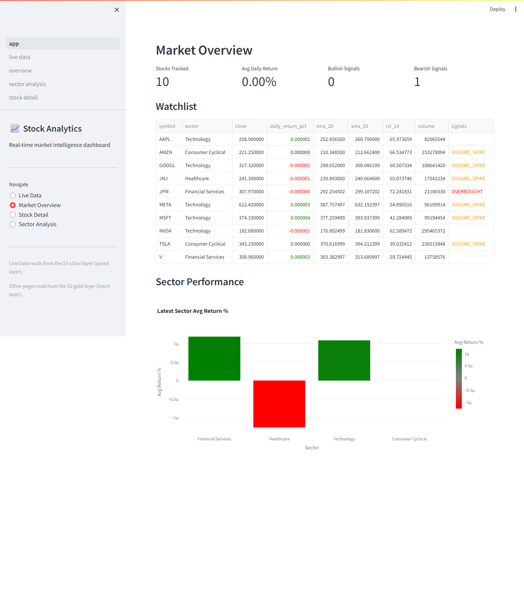
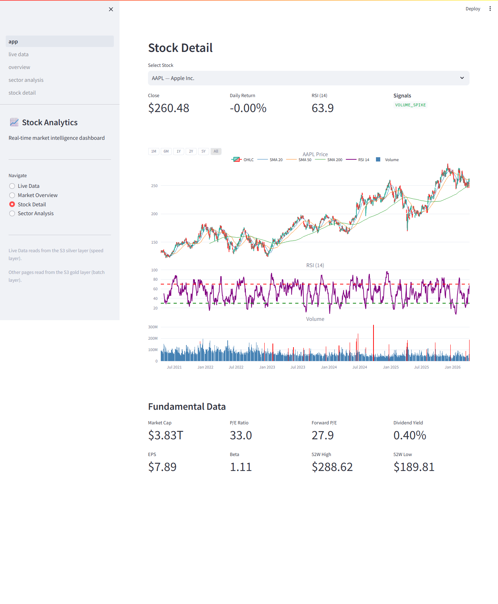
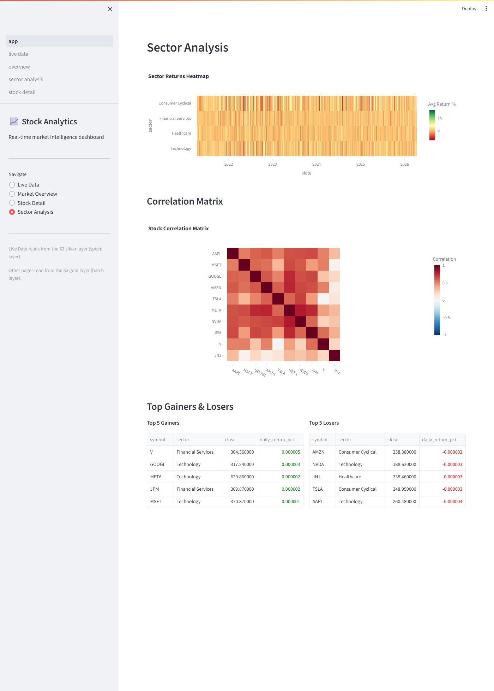

# Real-Time Stock Market Analytics Pipeline

[](https://github.com/YOUR_USERNAME/Real-Time-Stock-Market-Analysis/actions/workflows/ci.yaml)

[](LICENSE)

An end-to-end, real-time stock market analytics platform that ingests live
quotes from Alpha Vantage, streams them through Kafka and Spark Structured
Streaming, stores data in a **medallion architecture** (bronze → silver → gold)
on **AWS S3**, orchestrates batch enrichment with **Airflow**, and surfaces
interactive dashboards via **Streamlit** — all containerised with Docker and
deployed through **CloudFormation**.

---

## Architecture

```
┌────────────────┐     ┌───────────┐     ┌─────────────────────────┐
│  Alpha Vantage │────▶│   Kafka   │────▶│  Spark Structured       │
│  (quotes API)  │     │  Broker   │     │  Streaming              │
└────────────────┘     └───────────┘     └──────────┬──────────────┘
                                                    │
                         ┌──────────────────────────┘
                         ▼
              ┌─────────────────────────────────────────────┐
              │              AWS S3  Data Lake               │
              │  ┌─────────┐  ┌──────────┐  ┌────────────┐  │
              │  │ Bronze  │  │  Silver  │  │   Gold     │  │
              │  │ (JSON)  │──▶│(Parquet) │──▶│ (Parquet)  │  │
              │  └─────────┘  └──────────┘  └────────────┘  │
              └──────────────────┬──────────────────────────┘
                                 │
              ┌──────────────────┼──────────────────┐
              ▼                  ▼                   ▼
     ┌────────────┐    ┌──────────────┐    ┌──────────────┐
     │  Airflow   │    │  Streamlit   │    │  Databricks  │
     │  (DAGs)    │    │  Dashboard   │    │  Notebooks   │
     └────────────┘    └──────────────┘    └──────────────┘
```

---

## Tech Stack

| Layer             | Technology                          |
|-------------------|-------------------------------------|
| Ingestion         | Alpha Vantage API, Kafka 7.5        |
| Stream Processing | Spark Structured Streaming 3.5      |
| Batch Processing  | PySpark 3.5                         |
| Orchestration     | Apache Airflow 2.8                  |
| Storage           | AWS S3 (medallion architecture)     |
| Catalog / Query   | AWS Glue, Amazon Athena             |
| Dashboard         | Streamlit 1.31, Plotly 5.19         |
| Notebooks         | Databricks (PySpark)                |
| Infrastructure    | AWS CloudFormation, Docker Compose  |
| CI/CD             | GitHub Actions                      |
| Language          | Python 3.12                         |

---

## Prerequisites

| Tool        | Version  | Purpose                              |
|-------------|----------|--------------------------------------|
| Docker      | 24+      | Containerised services               |
| Python      | 3.12+    | Local development & testing          |
| AWS CLI     | 2.x      | Deploy CloudFormation / S3 access    |
| API Key     | —        | Free Alpha Vantage key ([get one](https://www.alphavantage.co/support/#api-key)) |

---

## Quick Start

```bash
# 1. Clone the repository
git clone https://github.com/YOUR_USERNAME/Real-Time-Stock-Market-Analysis.git
cd Real-Time-Stock-Market-Analysis

# 2. One-time setup (checks prerequisites, creates .env, builds images)
bash scripts/setup-local.sh

# 3. Fill in your keys in .env
#    ALPHA_VANTAGE_API_KEY, AWS_ACCESS_KEY_ID, AWS_SECRET_ACCESS_KEY

# 4. Start all services
make start

# 5. Open the dashboard
#    http://localhost:8501   — Streamlit analytics dashboard
#    http://localhost:8080   — Spark Master UI
#    http://localhost:8081   — Airflow UI  (admin / admin)

# 6. Stop everything
make stop
```

---

## Environment Variables

| Variable                  | Default                       | Description                      |
|---------------------------|-------------------------------|----------------------------------|
| `ALPHA_VANTAGE_API_KEY`   | —                             | Alpha Vantage API key            |
| `AWS_ACCESS_KEY_ID`       | —                             | AWS IAM access key               |
| `AWS_SECRET_ACCESS_KEY`   | —                             | AWS IAM secret key               |
| `AWS_DEFAULT_REGION`      | `us-east-1`                   | AWS region                       |
| `S3_BUCKET_NAME`          | `stock-market-datalake-bucket`| S3 data lake bucket              |
| `KAFKA_BROKER`            | `localhost:9092`              | Kafka bootstrap server           |
| `RUN_PIPELINE`            | `true`                        | Kill switch for the producer     |
| `MAX_ITERATIONS`          | `10`                          | Producer auto-stop limit         |
| `POLL_INTERVAL_SECONDS`   | `60`                          | Seconds between quote polls      |
| `ENVIRONMENT`             | `dev`                         | Environment name                 |

---

## Running the Demo

```bash
# Automated demo — starts services, produces data, opens dashboard
make demo

# Or use the helper script
bash scripts/run-demo.sh
```

The demo runs the producer for 5 iterations, triggers a historical backfill,
and opens the Streamlit dashboard so you can explore interactive charts.

---

## Deploying AWS Infrastructure

```bash
# Deploy all CloudFormation stacks (S3, Glue, IAM, Athena)
make deploy

# Validate templates first
make validate-cfn

# Tear down everything (cost protection!)
make teardown
```

> **Cost protection:** All resources use AWS free-tier eligible services.  
> Always run `make teardown` when you're done to avoid charges.

---

## Project Structure

```
Real-Time-Stock-Market-Analysis/
├── .github/
│   ├── instructions/          # Copilot coding instructions
│   └── workflows/             # GitHub Actions CI/CD
├── cloudformation/            # AWS CloudFormation templates
│   ├── 01-s3-datalake.yaml
│   ├── 02-glue-catalog.yaml
│   ├── 03-iam-roles.yaml
│   ├── 04-athena-workgroup.yaml
│   ├── deploy-all.sh
│   ├── teardown-all.sh
│   └── parameters/            # dev.json, prod.json
├── dags/                      # Airflow DAG definitions
│   ├── daily_batch_aggregation.py
│   ├── daily_historical_backfill.py
│   ├── data_quality_checks.py
│   └── fundamental_data_refresh.py
├── dashboards/                # Streamlit analytics dashboard
│   ├── app.py                 # Main app entry point
│   ├── data_loader.py         # S3 data reader + demo fallback
│   └── pages/
│       ├── overview.py        # Market overview & signals
│       ├── stock_detail.py    # Individual stock deep-dive
│       └── sector_analysis.py # Sector heatmaps & correlations
├── docker/                    # Docker build contexts
│   ├── docker-compose.yaml    # All services orchestration
│   ├── airflow/               # Airflow image
│   ├── dashboard/             # Streamlit image
│   ├── kafka-producer/        # Producer image
│   └── spark-jobs/            # Spark jobs image
├── notebooks/                 # Databricks exploration notebooks
│   ├── 01_explore_bronze.py
│   ├── 02_silver_analysis.py
│   └── 03_gold_insights.py
├── scripts/                   # Automation helpers
│   ├── create-kafka-topics.sh
│   ├── run-demo.sh
│   ├── seed-historical-data.sh
│   └── setup-local.sh
├── src/                       # Application source code
│   ├── batch/                 # PySpark batch jobs
│   │   ├── daily_aggregation.py
│   │   ├── fundamental_enrichment.py
│   │   └── historical_backfill.py
│   ├── common/                # Shared utilities
│   │   ├── indicators.py      # Technical indicator functions
│   │   ├── s3_utils.py        # S3 read/write helpers
│   │   └── schemas.py         # Pydantic data models
│   ├── config/
│   │   ├── settings.py        # Pydantic env-var config
│   │   └── watchlist.py       # 10-stock watchlist
│   ├── consumers/
│   │   └── spark_streaming.py # Spark Structured Streaming
│   └── producers/
│       └── stock_producer.py  # Kafka quote producer
├── tests/
│   ├── conftest.py            # Shared fixtures
│   ├── integration/           # Integration tests
│   │   ├── test_kafka_spark_flow.py
│   │   └── test_s3_write_read.py
│   └── unit/                  # Unit tests (8 modules)
├── .env.example               # Environment variable template
├── LICENSE                    # MIT License
├── Makefile                   # Developer task runner
├── README.md                  # ← you are here
├── requirements.txt           # Production dependencies
└── requirements-dev.txt       # Dev/test dependencies
```

---

## Data Flow

1. **Ingest** — `stock_producer.py` polls Alpha Vantage every 60 s, publishes
   JSON quotes to the `raw_stock_ticks` Kafka topic, and backs up raw data to
   S3 **bronze** layer.

2. **Stream** — `spark_streaming.py` reads from Kafka in micro-batches,
   validates records via Pydantic schemas, computes windowed aggregations
   (5-min, 15-min OHLCV rollups), detects volume anomalies, and writes
   cleaned Parquet to S3 **silver** layer.

3. **Batch** — PySpark jobs (triggered daily by Airflow):
   - `historical_backfill.py` — downloads 5-year OHLCV history via yfinance,
     writes bronze JSON + silver Parquet.
   - `daily_aggregation.py` — computes SMA, EMA, RSI, MACD, Bollinger Bands,
     generates trading signals, builds sector rollups & correlations → **gold**.
   - `fundamental_enrichment.py` — fetches P/E, market cap, dividend yield
     etc. from yfinance, joins with silver prices → **gold**.

4. **Orchestrate** — Four Airflow DAGs schedule and sequence all batch work
   with built-in data-quality checks.

5. **Visualise** — Streamlit dashboard reads gold-layer Parquet and presents:
   - Market overview table with colour-coded signals
   - Stock deep-dive with candlestick + SMA/RSI/volume charts
   - Sector heatmaps & correlation matrices

---

## Key Insights Generated

| Insight                   | Description                                               |
|---------------------------|-----------------------------------------------------------|
| Technical Signals         | SMA crossovers (golden/death cross), RSI overbought/oversold |
| Volume Anomalies          | Spikes > 2× the 20-day average                           |
| MACD Momentum             | MACD line vs signal line divergence                       |
| Sector Performance        | Daily average returns per sector                          |
| Pairwise Correlations     | 30-day rolling correlation between all stock pairs        |
| Fundamental Screening     | Undervalued stocks (forward P/E below market average)     |

---

## Screenshots

> *Screenshots will be added after the first live run.*

| View                | Description                          |
|---------------------|--------------------------------------|
| Market Overview     |  |
| Stock Detail        |  |
| Sector Analysis     |  |

---

## Testing

```bash
# Run all unit tests with coverage (≥80% required)
make test

# Verbose output
pytest tests/unit -v --cov=src --cov-report=term-missing --cov-fail-under=80

# Run integration tests (requires Docker services)
pytest tests/integration -v
```

The test suite covers 8 modules (220+ tests):
- Technical indicator calculations
- Pydantic schema validation
- S3 utility functions
- Kafka producer logic
- Spark streaming consumer
- PySpark batch jobs (backfill, aggregation, enrichment)

---

## CI/CD Pipeline

The GitHub Actions workflow (`.github/workflows/ci.yaml`) runs on every push
and pull request to `main`:

| Job                  | What it does                                         |
|----------------------|------------------------------------------------------|
| **Lint**             | ruff check, black --check, mypy                      |
| **Unit Tests**       | pytest with ≥80% coverage gate                       |
| **CFN Lint**         | Validates CloudFormation YAML                        |
| **Docker Build**     | Builds all Dockerfiles to verify no build errors     |

Additional workflows handle image publishing (`build-images.yaml`),
infrastructure deployment (`deploy-infra.yaml`), and teardown
(`teardown-infra.yaml`).

---

## Contributing

1. Fork the repo and create a feature branch.
2. Follow the coding conventions in `.github/instructions/`.
3. Write tests first (TDD) — maintain ≥80% coverage.
4. Run `make lint` and `make test` before pushing.
5. Open a pull request against `main`.

---

## License

This project is licensed under the **MIT License** — see [LICENSE](LICENSE)
for details.