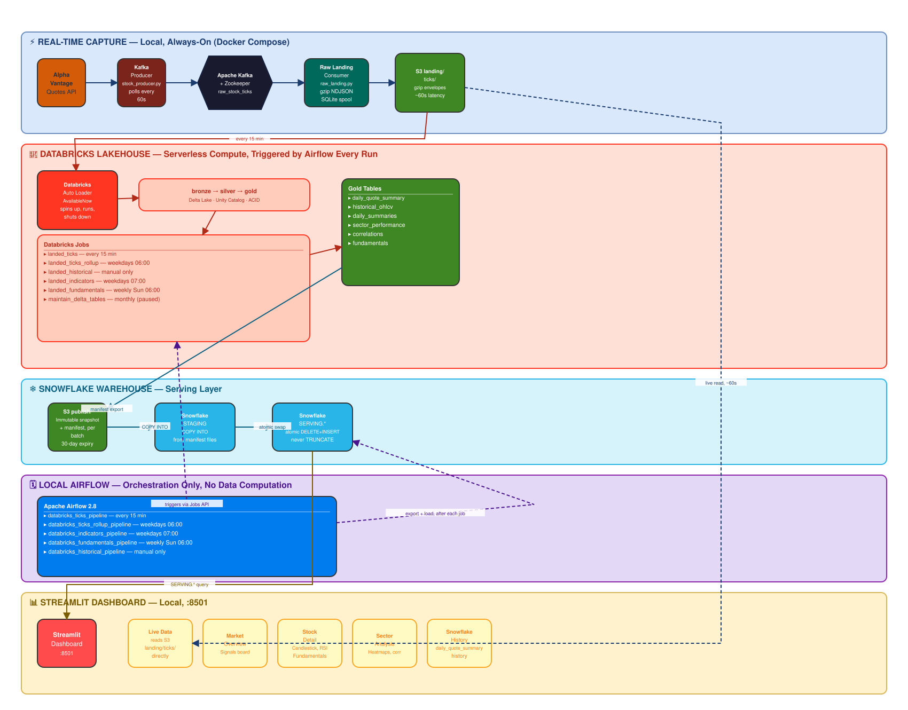

# Real-Time Stock Market Analytics Pipeline

[](https://github.com/Vulasala-Hari-Krishna/Real-Time-Stock-Market-Analysis/actions/workflows/ci.yaml)

[](LICENSE)



> **[Open in draw.io →](docs/architecture.drawio)** for the editable version.

**In one sentence:** this project watches live stock prices for 10 major
companies, continuously records and cleans that data in the cloud, works
out useful patterns and trends from it, and shows the results on a web
dashboard you can open in your browser.

It's built the way a real financial-data or trading company would build
this kind of system internally — using the same categories of tools
(a real-time message queue, a cloud "data lakehouse", a cloud data
warehouse, an automated scheduler, and a dashboard) — just aimed at a
small, free, personal-scale slice of the stock market instead of an
entire exchange.

This README is written so that anyone — a software engineer, a data/
business person, or someone with no technical background at all — can
read it and come away understanding what the project does, why it's put
together the way it is, and how the pieces fit. Technical sections are
clearly separated further down for readers who want implementation detail.

**Contents:** [What This Project Does](#what-this-project-does-no-technical-background-required) ·
[How It Works](#how-it-works--a-plain-english-walkthrough) ·
[Glossary](#glossary--key-terms-in-plain-english) ·
[Why It Matters](#why-the-insights-matter-business-value) ·
[Architecture](#architecture-technical-detail) ·
[Business Keys](#business-keys) ·
[Tech Stack](#tech-stack) ·
[Docker Services](#docker-services) ·
[Prerequisites](#prerequisites) ·
[Quick Start](#quick-start) ·
[Environment Variables](#environment-variables) ·
[Deploying Infrastructure](#deploying-infrastructure) ·
[Project Structure](#project-structure) ·
[Testing](#testing) ·
[CI/CD](#cicd-pipeline) ·
[Contributing](#contributing) ·
[License](#license)

---

## What This Project Does (No Technical Background Required)

Imagine you wanted to keep an eye on 10 well-known companies' stock prices
— Apple, Microsoft, Google, Amazon, Tesla, Meta, NVIDIA, JPMorgan, Visa,
and Johnson & Johnson — not just the current price, but also:

- **What's happening right now** — a live, constantly-updating price board.
- **What's happened over time** — daily price history going back years,
  so you can see trends, not just a single snapshot.
- **Whether a stock looks "interesting"** — is it unusually cheap or
  expensive lately? Is trading volume spiking? Is it moving in the same
  direction as other stocks in its industry, or against them?
- **How industries (sectors) are doing** — is Technology having a good
  week? Is Healthcare lagging?
- **Basic company facts** — how big is the company (market value), how
  expensive is its stock relative to its profits (P/E ratio), how much
  does it pay in dividends, and so on.

This project does exactly that, automatically, around the clock, and
presents it all in a dashboard with charts, tables, and highlighted
"signals" — without you having to manually check a stock site or crunch
any numbers yourself.

**Why build this instead of just using a stock app?** Because the point
isn't really the stock data itself — it's a compact, understandable,
free-to-run demonstration of how large financial and tech companies
actually build systems that handle continuously-arriving data at scale:
capture it reliably, clean and organize it automatically, compute
insights from it, and serve it to people through a simple interface.
Stock prices are just a relatable, easy-to-verify subject matter for
showing that whole pipeline end to end.

---

## How It Works — A Plain-English Walkthrough

Here's the journey a single stock price takes, step by step, with
plain-English descriptions of each piece (the proper technical names are
in parentheses, explained further in the [glossary](#3-glossary--key-terms-in-plain-english)
below):

1. **Checking the price.** A small always-running program asks a stock
   price API (Alpha Vantage) "what's the current price of AAPL?" every
   60 seconds, for each of the 10 companies being tracked. (`Kafka producer`)

2. **Dropping it in a queue.** That price gets dropped into a real-time
   message queue — think of it like a conveyor belt or an inbox that
   never loses a message, even if whatever reads from it is temporarily
   busy or restarting. (`Kafka`)

3. **Filing a permanent copy.** A second small program continuously reads
   everything off that conveyor belt and writes an exact, permanent copy
   into cloud file storage (`Amazon S3`) — like a filing cabinet that
   never throws anything away and keeps a receipt of exactly when and
   where each item came from, so nothing is ever silently lost. This
   copy typically lands within about a minute of the original price
   check. (`raw landing consumer`)

4. **The cloud "factory" picks it up.** Roughly every 15 minutes, a
   powerful cloud computing platform (`Databricks`) wakes up, reads
   whatever new files have shown up in that filing cabinet, and:
   - checks each record for obvious problems (missing data, impossible
     values) and sets bad ones aside rather than silently accepting them,
   - removes duplicates (the same price accidentally recorded twice),
   - and organizes everything into clean, well-structured tables.

   This "factory" then shuts itself down until the next 15-minute check —
   it only runs (and only costs money) while it's actually doing work,
   rather than sitting on 24/7 like a machine left idling.

5. **Turning raw prices into insights.** Once a day, the same cloud
   platform runs additional jobs that turn the accumulated price history
   into the more interesting stuff: daily price summaries, technical
   indicators (moving averages, momentum signals), which sectors are
   outperforming, which stocks tend to move together, and up-to-date
   company fundamentals (P/E ratio, market cap, etc.). One job also does
   a one-time (or occasionally re-run) deep historical backfill covering
   several years of data, so there's a real trend to look at, not just a
   few days.

6. **Copying the results somewhere fast to query.** The finished,
   organized results are then copied into a second cloud system
   (`Snowflake`) that's specifically built to answer questions over data
   very quickly — the same category of system banks and retailers use
   for their own reporting and analytics.

7. **Showing it to you.** A web dashboard (built with `Streamlit`) reads
   from that fast-query system and draws the charts, tables, and colour-
   coded signals you actually look at in your browser. One dashboard page
   also reads directly from the filing-cabinet copy in step 3, so you can
   see genuinely live prices (updated roughly every minute) without
   waiting for the 15-minute cloud-factory cycle.

8. **Who's in charge of the schedule?** A scheduling/orchestration tool
   (`Apache Airflow`) is the "conductor" — every 15 minutes, once a day,
   and once a week, it wakes up and tells the cloud factory "go do your
   job now," then waits for it to finish and tells the fast-query system
   "here's the new data, go publish it." Airflow itself does no heavy
   computation; it only ever gives instructions and waits for confirmation.

Nothing above is simulated after the initial setup — every piece listed
has actually been deployed to real cloud accounts and confirmed working
with real data, not just written and left untested.

---

## Glossary — Key Terms in Plain English

| Term | What it actually means here |
|------|------------------------------|
| **Kafka** | A real-time message queue. Producers drop messages in, consumers read them out, and nothing gets lost even if a reader is briefly offline. Used here to carry live stock quotes. |
| **S3 (Amazon S3)** | Cloud file storage — like an enormous, always-available hard drive in the cloud, organized into folders ("buckets" and "prefixes"). |
| **Databricks** | A cloud platform for processing large amounts of data using the Apache Spark engine. It's where the "cleaning and organizing" and "computing insights" steps happen. |
| **Delta Lake / Unity Catalog** | The specific table format and cataloguing system Databricks uses so that data can be updated safely and reliably (no half-finished writes, full history of changes) instead of being just loose files. |
| **Auto Loader** | The specific Databricks feature that watches cloud storage for new files and processes only what's new each time, rather than re-reading everything. |
| **Bronze / Silver / Gold** | A common naming convention for how raw data gets progressively refined: **bronze** = raw, as-received; **silver** = cleaned and validated; **gold** = fully organized and ready for reporting/analysis. |
| **Snowflake** | A cloud data warehouse — a database built specifically to answer analytical questions ("what was the average return by sector last month?") very fast, over large amounts of data. |
| **Airflow** | A scheduler/orchestrator. It doesn't do the data work itself — it decides *when* other systems should run, and tracks whether they succeeded. |
| **Streamlit** | A Python tool for building simple, interactive web dashboards without needing to write HTML/JavaScript by hand. |
| **Docker / Docker Compose** | A way of packaging a program and everything it needs to run into a self-contained "container," and a tool for starting up several related containers together with one command. |
| **CloudFormation / Terraform** | Tools that let you describe cloud infrastructure (storage, permissions, servers) as a text file, so it can be created, changed, or torn down consistently instead of by hand-clicking through a cloud provider's website. |
| **CI/CD (Continuous Integration/Deployment)** | Automated checks (tests, code-quality checks) that run every time code changes, so mistakes are caught before they reach the real system. |
| **P/E ratio, market cap, RSI, MACD, SMA** | Standard stock-market terms: how expensive a stock is relative to its profits, how large the company is worth in total, and a couple of common ways traders judge whether a price move is likely to continue or reverse. |

---

## Why the Insights Matter (Business Value)

| Insight | What it tells a reader, in plain terms |
|---------|------------------------------------------|
| Live price board | What's happening with these stocks right now, without needing a separate app |
| Volume anomalies | A stock is suddenly being traded far more than usual — often a sign something newsworthy is happening |
| Technical signals (SMA crossovers, RSI) | Common, widely-used rules of thumb traders use to judge whether a stock might be "overbought" (due for a pullback) or "oversold" (due for a bounce) |
| MACD momentum | Whether a stock's recent price momentum is strengthening or fading |
| Sector performance | Whether a whole industry (not just one company) is having a good or bad stretch |
| Pairwise correlations | Which stocks tend to rise and fall together — useful for understanding diversification |
| Fundamental screening | Whether a stock looks cheap or expensive compared to its own earnings, independent of recent price swings |
| Historical trends | Years of daily price history, so short-term noise can be told apart from a genuine long-term trend |

None of this requires the reader to understand any of the underlying
cloud engineering — the dashboard is the point of contact for that value;
everything described in the rest of this README exists to get that data
there reliably, automatically, and honestly (see the honesty note below).

**One deliberate design principle worth calling out:** whenever the
dashboard can't reach live data (a brief cloud outage, for example), it
never silently shows fake numbers as if they were real. It shows either
the last known-good real data with a clear "stale" warning, or clearly
labelled example data — always with a visible banner saying which one
you're looking at.

---

## Architecture (Technical Detail)

Everything above is implemented, deployed, and live-verified — this is
the actual current architecture, not a plan or work in progress. The
project originally started as a fully local Kafka/Spark/Airflow pipeline;
it was then migrated onto Databricks and Snowflake, and once that
migration was complete and verified, the original local Spark
cluster/batch jobs and the AWS Athena/Glue querying layer they used were
retired. What follows is the single, current architecture.

```
Alpha Vantage ──▶ Kafka Producer ──▶ Kafka Broker
                                        │
                                        ▼
                              Raw Landing Consumer
                        (plain Python, gzip NDJSON envelopes,
                         preserves original Kafka bytes/offsets)
                                        │
                                        ▼
                          S3 landing/ticks/  ◀── read directly by the
                                        │        dashboard's Live Data page
                                        ▼
                    Databricks Auto Loader (triggered every 15 min by Airflow)
                                        │
                       bronze ──▶ silver ──▶ gold  (Delta Lake, Unity Catalog)
                        │                      │
                        │        ┌─────────────┼─────────────────┐
                        │        │             │                 │
                 landed_ticks  landed_historical (manual)   landed_ticks_rollup (daily)
                        │        │                                │
                        │        └───────────────┬────────────────┘
                        │                 landed_indicators (daily)
                        ▼                         ▼
              daily_quote_summary      historical_ohlcv, daily_summaries,
                                        sector_performance, correlations
                        │                         │
                        └───────────┬─────────────┘
                                    ▼
                  Immutable S3 snapshot export + manifest (per batch)
                                    │
                                    ▼
                 Snowflake: COPY INTO staging ──▶ MERGE-swap into SERVING
                                    │
                                    ▼
                     Streamlit (reads SERVING.* + S3 landing/ticks/)

Local Airflow triggers every Databricks job above and runs the Snowflake
export/load step after each one succeeds.
```

### Why Databricks runs on a schedule, not continuously

Kafka's producer and raw-landing consumer run continuously (same as any
always-on service) - that part genuinely is real-time, landing new ticks in
S3 roughly every 60 seconds. Databricks compute, unlike your own machine,
is billed for every minute it's alive, so `landed_ticks` uses Auto
Loader's `AvailableNow` trigger (catch up on new files, then shut down)
on a 15-minute Airflow schedule instead of a permanently-running streaming
job - a deliberate cost/latency trade-off, not a limitation. The dashboard's
**Live Data** page reads the S3 landing files directly, independent of
Databricks' batch cadence, so a genuinely live view still exists.

### Databricks jobs

| Job | Trigger | Role |
|-----|---------|------|
| `landed_ticks` | Airflow, every 15 min | Auto Loader ingests `landing/ticks/` → bronze → validate/dedup/quarantine → silver `quote_samples` → gold `daily_quote_summary` (daily sampled-quote aggregate, not exchange OHLCV) |
| `landed_ticks_rollup` | Airflow, weekdays 06:00 UTC | Cheap, zero-external-API sync: rolls `daily_quote_summary` into `historical_ohlcv`/`historical_ohlcv_raw` - the routine daily feeder of the historical table |
| `landed_historical` | Manual only | Full 5-year yfinance backfill into the same `historical_ohlcv` tables `landed_ticks_rollup` feeds - the rare/one-time feeder, mirroring "backfill once, sync cheaply every day after" |
| `landed_indicators` | Airflow, weekdays 07:00 UTC | Reads `historical_ohlcv`, computes indicators/signals/sector performance/correlations |
| `landed_fundamentals` | Airflow, weekly Sunday 06:00 UTC | yfinance company fundamentals (P/E, market cap, beta, etc.) |
| `maintain_delta_tables` | Databricks-native schedule, monthly (last Sunday), ships paused | OPTIMIZE + VACUUM across every owned Delta table |

### Airflow DAGs

Local Airflow's only role is triggering the Databricks jobs above (via the
Databricks Jobs API) and then exporting/loading their gold output into
Snowflake - it does no computation itself. Every DAG follows the same
shape: trigger job → export gold snapshot to S3 → load into Snowflake
staging → MERGE-swap into serving.

| DAG | Schedule |
|-----|----------|
| `databricks_ticks_pipeline` | Every 15 min (short-circuits if nothing new landed) |
| `databricks_ticks_rollup_pipeline` | Weekdays 06:00 UTC |
| `databricks_indicators_pipeline` | Weekdays 07:00 UTC |
| `databricks_fundamentals_pipeline` | Weekly Sunday 06:00 UTC |
| `databricks_historical_pipeline` | Manual only |

### Snowflake

`src/load/snowflake_snapshot.py` loads every dataset the same way: `COPY
INTO` an isolated staging table from the exact manifest-listed export
files, then an all-or-nothing `DELETE`+`INSERT` swap into the matching
`SERVING.*` table (never `TRUNCATE`/`CREATE OR REPLACE`, since those
auto-commit and would break the swap's atomicity). `SERVING.*` is what the
dashboard and any ad-hoc SQL analysis reads.

### Dashboard

| Page | Data source | What it shows |
|------|-------------|----------------|
| Live Data | S3 `landing/ticks/` directly (last ~15 min of raw Kafka captures) | Real-time price board, intraday chart, today's movers |
| Market Overview | Snowflake `SERVING.DAILY_SUMMARIES` / `SERVING.SECTOR_PERFORMANCE` | Watchlist table with colour-coded technical signals, sector performance bar chart |
| Stock Detail | Snowflake `SERVING.DAILY_SUMMARIES` / `SERVING.FUNDAMENTALS` | Candlestick + SMA/RSI/volume chart and fundamentals for one chosen stock |
| Sector Analysis | Snowflake `SERVING.SECTOR_PERFORMANCE` / `SERVING.DAILY_SUMMARIES` / `SERVING.CORRELATIONS` | Sector heatmap, correlation matrix, top gainers/losers |
| Snowflake History | Snowflake `SERVING.DAILY_QUOTE_SUMMARY` | Daily sampled-quote summary history per symbol |

Every Snowflake-backed page shows an explicit, honest status banner - real
data from Snowflake, real-but-stale data from a local cache (if Snowflake
is briefly unreachable), or clearly-labelled synthetic demo data (only
when no cache exists yet). Nothing is ever silently faked.

---

## Business Keys

Every gold/serving table is deduplicated and republished (full overwrite
on the Databricks side, atomic `DELETE`+`INSERT` swap on the Snowflake
side) on these business keys - the columns that make a row unique,
regardless of how many times it's recomputed:

| Table | Business Key |
|-------|--------------|
| `daily_quote_summary` | `provider` + `symbol` + `capture_date_utc` |
| `historical_ohlcv` | `symbol` + `date` |
| `daily_summaries` | `symbol` + `date` |
| `sector_performance` | `sector` + `date` |
| `correlations` | `symbol_a` + `symbol_b` + `date` |
| `fundamentals` | `symbol` |

---

## Tech Stack

| Layer | Technology |
|-------|------------|
| Ingestion | Alpha Vantage API, Kafka 7.5 |
| Local capture | Plain Python Kafka consumer (no Spark), SQLite-spooled, gzip NDJSON to S3 |
| Lakehouse | Databricks (Auto Loader, Delta Lake, Unity Catalog), serverless compute |
| Warehouse | Snowflake (key-pair auth, least-privilege loader/reader roles) |
| Orchestration | Apache Airflow 2.8 (triggers Databricks Jobs API, no local compute) |
| Dashboard | Streamlit 1.31, Plotly 5.19, `snowflake-connector-python` |
| Infrastructure | AWS CloudFormation, Terraform (Databricks/Snowflake platform objects), Docker Compose |
| CI/CD | GitHub Actions |
| Language | Python 3.11 |

---

## Docker Services

| Service | Purpose |
|---------|---------|
| `stock-zookeeper` / `stock-kafka` / `kafka-init` | Kafka broker + topic bootstrap |
| `stock-kafka-producer` | Polls Alpha Vantage, publishes to Kafka |
| `raw-consumer` | Lands raw Kafka envelopes in S3 `landing/ticks/` - the sole bridge into the hybrid pipeline, runs by default |
| `stock-airflow-postgres` / `stock-airflow-webserver` / `stock-airflow-scheduler` | Local Airflow (port 8081), auto-provisions its Databricks connection on startup |
| `stock-streamlit` | Analytics dashboard (port 8501) |

---

## Prerequisites

| Tool | Version | Purpose |
|------|---------|---------|
| Docker | 24+ | Containerised local services |
| Python | 3.11+ | Local development & testing |
| AWS CLI | 2.x | S3/CloudFormation access |
| API Key | — | Free Alpha Vantage key ([get one](https://www.alphavantage.co/support/#api-key)) |
| Databricks workspace | Free Edition or higher | Runs the Databricks bundle (`databricks/`) |
| Snowflake account | Trial or higher | Runs the Terraform-provisioned warehouse/database (`snowflake/`) |

---

## Quick Start

```bash
# 1. Clone the repository
git clone https://github.com/Vulasala-Hari-Krishna/Real-Time-Stock-Market-Analysis.git
cd Real-Time-Stock-Market-Analysis

# 2. One-time setup (checks prerequisites, creates .env, builds images)
bash scripts/setup-local.sh

# 3. Fill in your keys in .env - Alpha Vantage, AWS, and (for the full
#    pipeline) Databricks + Snowflake credentials, see .env.example

# 4. Start local services (Kafka, raw landing, Airflow, Streamlit)
make start

# 5. Deploy/redeploy the Databricks bundle and Terraform-managed platform
#    objects separately - see databricks/README.md and snowflake/README.md
#    (deployment is deliberately not part of `make start`)

# 6. Open the dashboard
#    http://localhost:8501   — Streamlit analytics dashboard
#    http://localhost:8081   — Airflow UI (admin / admin)

# 7. Stop local services
make stop
```

---

## Environment Variables

See [.env.example](.env.example) for the full, commented list - Alpha
Vantage/AWS/Kafka basics, the raw-landing consumer's configuration
(`RAW_LANDING_ENABLED`, `RAW_SOURCE_ID`, etc.), and the Databricks/
Snowflake identifiers Airflow and the dashboard need. Secrets
(`SNOWFLAKE_PRIVATE_KEY`, `DATABRICKS_TOKEN`, etc.) are read directly from
the environment, never hardcoded.

### Changing the AWS Region

All components read the region from a single source:

- **Local / Docker**: set `AWS_DEFAULT_REGION` in your `.env` file. This
  flows to Python code (`settings.py`), shell scripts, and the dashboard
  automatically.
- **GitHub Actions**: when triggering a deploy/teardown workflow, enter the
  desired region in the `aws-region` input field, or set a repository
  variable named `AWS_REGION`.

---

## Deploying Infrastructure

Three independent layers, each deployed separately (never all via one
command - this is deliberate, since they have different owners and
different blast radii):

```bash
# AWS: S3 data lake bucket + IAM (stacks 01, 03)
make deploy
make validate-cfn   # cfn-lint first
make teardown        # tear down when done

# AWS: hybrid access policies for Databricks/Snowflake (stacks 05, 06)
make deploy-hybrid
make teardown-hybrid  # run before `make teardown`

# Databricks and Snowflake platform objects + job bundle: see
# databricks/README.md and snowflake/README.md for the Terraform roots
# and GitHub Actions workflows that provision them.
```

> **Cost protection:** tear down every layer when you're done -
> `make teardown-hybrid` before `make teardown`, and the Databricks/
> Snowflake teardown workflows documented in their own READMEs.

---

## Project Structure

```
Real-Time-Stock-Market-Analysis/
├── .github/
│   ├── instructions/          # Scoped coding instructions per domain
│   └── workflows/              # CI, deploy/teardown workflows
├── cloudformation/             # AWS CloudFormation templates (01, 03, 05, 06, 07)
│   ├── deploy-all.sh / teardown-all.sh
│   ├── deploy-hybrid.sh / teardown-hybrid.sh
│   └── parameters/             # dev.json, prod.json
├── dags/                       # Airflow DAGs - all trigger Databricks jobs
│   ├── databricks_pipeline_common.py   # Shared trigger/export/load helper
│   ├── databricks_job_names.py
│   ├── databricks_ticks_pipeline.py
│   ├── databricks_ticks_rollup_pipeline.py
│   ├── databricks_indicators_pipeline.py
│   ├── databricks_fundamentals_pipeline.py
│   └── databricks_historical_pipeline.py
├── databricks/                 # Databricks Asset Bundle (jobs + Terraform platform IaC)
├── dashboards/                 # Streamlit dashboard
│   ├── app.py                  # Entry point / navigation
│   ├── data_loader.py           # Shared static watchlist constants
│   ├── snowflake_loader.py      # Snowflake-backed dataset loader (with local cache + demo fallback)
│   ├── landing_reader.py        # Live-tick reader (S3 landing/ticks/, no Databricks round trip)
│   ├── local_cache.py           # Bounded local cache backing the Snowflake loader
│   ├── load_status.py           # Shared LoadStatus type + honesty banner
│   └── pages/                   # live_data, overview, stock_detail, sector_analysis, snowflake_history
├── docker/                      # Docker build contexts + docker-compose.yaml
│   ├── airflow/ dashboard/ kafka-producer/ raw-consumer/
├── docs/                        # Architecture contracts and the implementation handover ledger
├── scripts/                     # setup-local.sh, create-kafka-topics.sh
├── snowflake/                   # Snowflake SQL DDL + Terraform platform IaC
├── src/
│   ├── batch/                   # Databricks job runners + transforms
│   │   ├── databricks_*.py      # Job runners (bronze/silver/gold orchestration)
│   │   ├── landed_*.py          # Pure Spark transforms
│   │   ├── daily_aggregation.py # Indicator transforms - reused by databricks_indicators.py
│   │   └── historical_backfill.py # yfinance fetch helper - reused by landed_historical.py
│   ├── common/                  # schemas.py (shared Pydantic models), s3_utils.py
│   ├── config/                  # settings.py (env-var config), watchlist.py
│   ├── consumers/
│   │   └── raw_landing.py       # The Kafka → S3 landing bridge
│   ├── producers/
│   │   └── stock_producer.py    # Kafka quote producer
│   ├── export/                  # Gold → S3 snapshot exporter (manifest-gated)
│   └── load/                    # S3 → Snowflake loader (staging → serving swap)
├── tests/
│   ├── unit/                    # Unit tests, hermetic (mocked cloud clients)
│   └── integration/              # Opt-in, gated tests
├── .env.example
├── LICENSE
├── Makefile
├── README.md                    # ← you are here
├── requirements.txt
└── requirements-dev.txt
```

---

## Testing

```bash
# Run all unit tests with coverage (≥80% required)
make test

# Verbose output
pytest tests/unit -v --cov=src --cov-report=term-missing --cov-fail-under=80

# Run integration tests (opt-in, gated)
pytest tests/integration -v -m integration
```

The unit suite is fully hermetic - every Kafka/S3/Databricks/Snowflake
client is mocked, so it never touches real cloud infrastructure.

---

## CI/CD Pipeline

The GitHub Actions workflow (`.github/workflows/ci.yaml`) runs on every
push and pull request to `main`:

| Job | What it does |
|-----|---------------|
| **Lint** | ruff, black --check, mypy across `src/`, `tests/`, `dags/`, `dashboards/` |
| **Unit Tests** | pytest with ≥80% coverage gate |
| **CFN Lint** | Validates CloudFormation YAML |
| **Databricks IaC** | Offline `terraform fmt/validate/test` for the Databricks Terraform roots |
| **Docker Build** | Builds every Dockerfile under `docker/` to verify no build errors |

Additional manual-only workflows (GitHub Actions UI): deploy/teardown for
AWS infra, the Databricks platform + job bundle, and the Snowflake
platform - see `databricks/README.md` and `snowflake/README.md`.
GitHub Actions only ever deploys/updates/tears down infrastructure - it
never triggers business-data job runs (the one documented exception is
`maintain_delta_tables --drop-tables` during teardown, which is
infrastructure housekeeping, not a business-data run).

---

## Contributing

1. Fork the repo and create a feature branch.
2. Follow the coding conventions in `.github/instructions/`.
3. Write tests first (TDD) — maintain ≥80% coverage.
4. Run `make lint` and `make test` before pushing.
5. Open a pull request against `main`.

---

## License

MIT License - see [LICENSE](LICENSE) for details.
